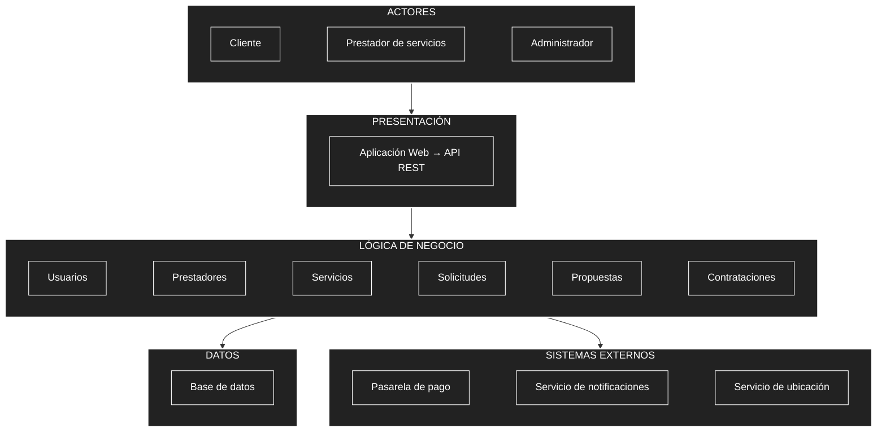

# Arquitectura inicial del sistema

## Arquitectura en tres capas

La arquitectura inicial de la plataforma se organiza en tres capas principales: presentación, lógica de negocio y datos.

| Capa | Pregunta que responde | Elementos |
|---|---|---|
| Presentación | ¿Cómo interactúa el usuario? | Aplicación Web y API REST |
| Lógica de negocio | ¿Qué hace el sistema? | Usuarios, Prestadores, Servicios, Solicitudes, Propuestas y Contrataciones |
| Datos | ¿Dónde se almacena la información? | Base de datos |

## Diagrama de arquitectura

## Descripción

La arquitectura inicial se organiza en tres capas principales:

- **Presentación:** permite la interacción del cliente, prestador de servicios y administrador con el sistema mediante la aplicación web y la API REST.
- **Lógica de negocio:** contiene los módulos principales de usuarios, prestadores, servicios, solicitudes, propuestas y contrataciones.
- **Datos:** almacena y permite consultar la información de la plataforma mediante una base de datos.

Además, la lógica de negocio se integra con sistemas externos como la pasarela de pago, el servicio de notificaciones y el servicio de ubicación.